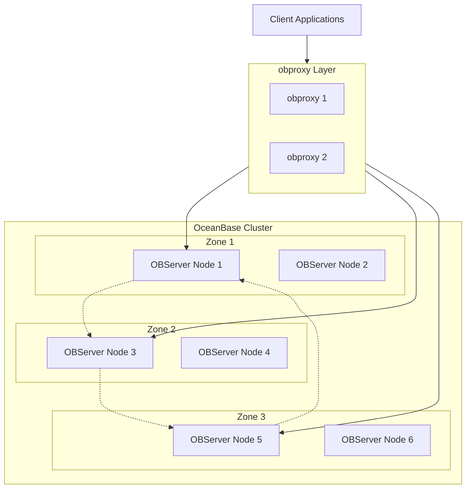
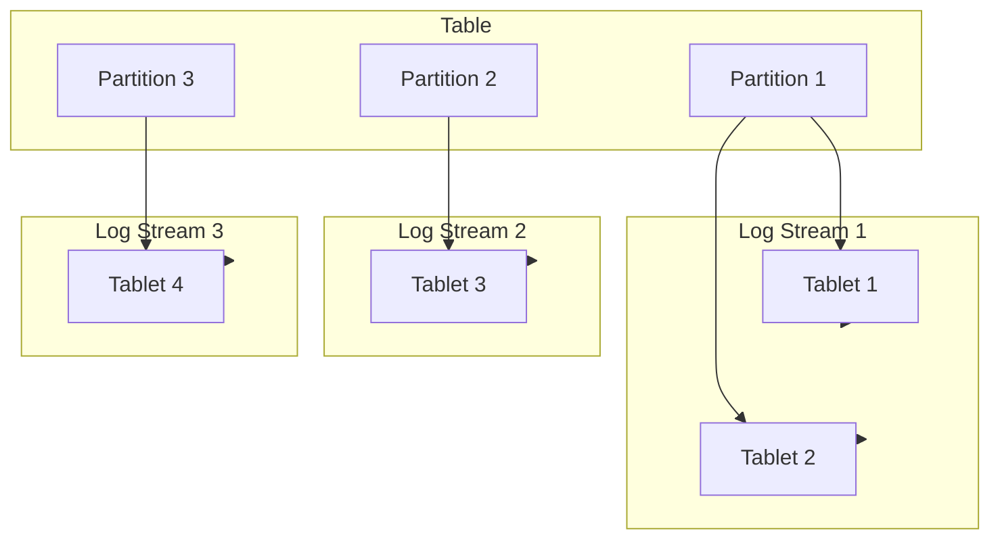
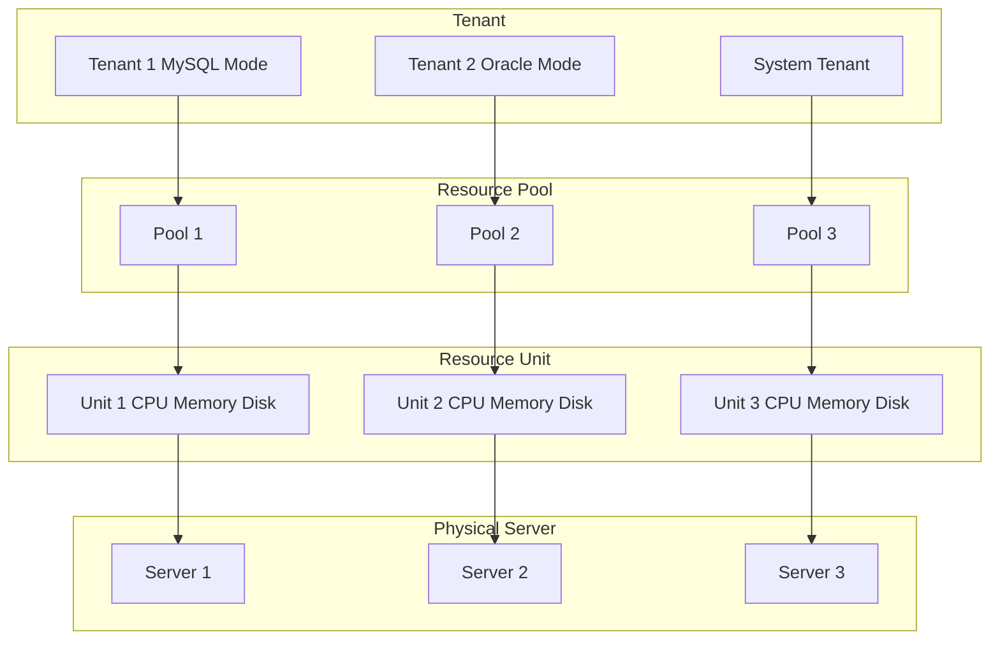
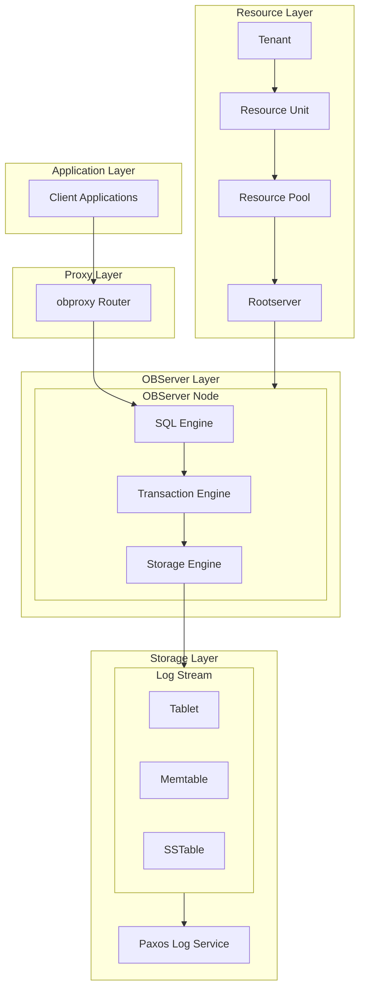
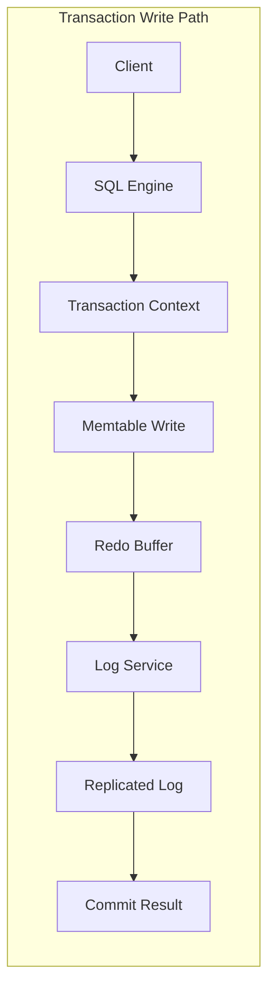
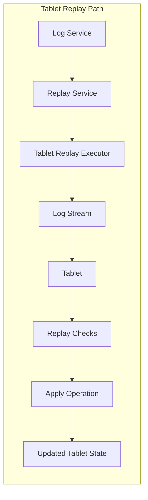
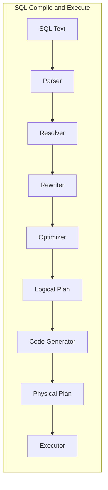
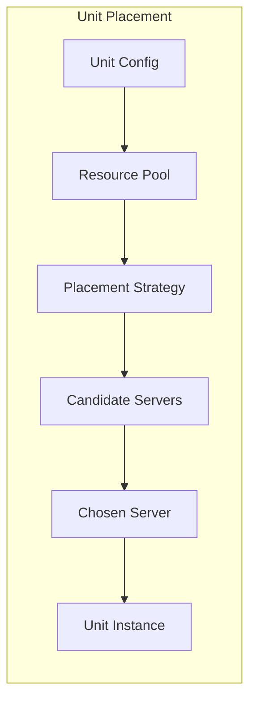

## Why These Paths Matter

OceanBase targets high availability and scalability in a shared-nothing cluster. The core engineering challenge is to make four critical subsystems work together with predictable latency and correctness:

- Write transactions must be durable, replicated, and efficiently committed.
- Tablet replay must recover state quickly and safely.
- SQL parse to execute must optimize well while respecting multi-tenant constraints.
- Unit placement must map tenants to physical resources without fragmentation.

This article focuses on motivation, design, implementation highlights, and tradeoffs, using concrete code entry points from the OceanBase codebase.

## System Architecture

OceanBase adopts a shared-nothing architecture where each node is equal and runs its own SQL engine, storage engine, and transaction engine. Understanding the overall architecture is essential before diving into implementation details.

### Cluster, Zone, and Node Organization

**Key Concepts:**
- **Cluster**: A collection of nodes working together
- **Zone**: Logical availability zones for high availability and disaster recovery
- **OBServer**: Service process on each node handling SQL, storage, and transactions
- **obproxy**: Stateless proxy layer routing SQL requests to appropriate OBServer nodes

### Data Organization: Partition, Tablet, and Log Stream

**Key Concepts:**
- **Partition**: Logical shard of a table (hash, range, list partitioning)
- **Tablet**: Physical storage object storing ordered data records for a partition
- **Log Stream (LS)**: Replication unit using Multi-Paxos for data consistency
- **Replication**: Each tablet has multiple replicas across zones, with one leader accepting writes. Log streams replicate data via Multi-Paxos protocol across different zones.

### Multi-Tenant Resource Model

**Key Concepts:**
- **Tenant**: Isolated database instance (MySQL or Oracle compatibility)
- **Resource Pool**: Groups resource units for a tenant across zones
- **Resource Unit**: Virtual container with CPU, memory, and disk resources
- **Unit Placement**: Rootserver schedules units to physical servers based on resource constraints

### Layered Architecture

**Key Concepts:**
- **SQL Engine**: Parses, optimizes, and executes SQL statements
- **Transaction Engine**: Manages transaction lifecycle, commit protocols, and consistency
- **Storage Engine**: Handles data organization, memtables, and SSTables
- **Log Service**: Provides Paxos-based replication and durability
- **Rootserver**: Manages cluster metadata, resource scheduling, and placement

## Design Overview

At a high level, each node runs a full SQL engine, storage engine, and transaction engine. Data is organized into tablets, which belong to log streams. Log streams replicate changes using Paxos-based log service. Tenants slice resources via unit configurations and pools, while rootserver components place those units on servers.

The following sections walk through each path with the relevant implementation anchors.

## Architecture Diagrams

### Transaction Write Path

### Tablet Replay Path

### SQL Compile and Execute

### Unit Placement

## Write Transaction: From Memtable to Replicated Log

### Motivation

A write transaction must be both fast and durable. OceanBase uses memtables for in-memory writes, and a log stream for redo replication. The design must allow low-latency commit while supporting parallel redo submission and multi-participant (2PC) transactions.

### Design Sketch

- Each transaction is represented by a per-LS context (`ObPartTransCtx`).
- Redo is flushed based on pressure or explicit triggers.
- Commit chooses one-phase or two-phase based on participants.
- Logs are submitted via a log adapter backed by logservice.

### Implementation Highlights

- Transaction context lifecycle and commit logic are in `src/storage/tx/ob_trans_part_ctx.cpp`.
- Redo submission is driven by `submit_redo_after_write`, which switches between serial and parallel logging based on thresholds.
- Commit decides between one-phase and two-phase commit depending on participant count.
- The log writer (`ObTxLSLogWriter`) submits serialized logs via `ObITxLogAdapter`, which is wired to logservice (`ObLogHandler`).

### Tradeoffs

- **Serial vs parallel redo**: Serial logging is simpler and cheaper for small transactions, but parallel logging reduces tail latency for large transactions at the cost of more coordination.
- **1PC vs 2PC**: 1PC is fast for single-participant transactions; 2PC is required for distributed consistency but increases coordination overhead.
- **In-memory batching vs durability**: Larger batching improves throughput but can delay durability and increase replay time.

## Tablet Replay: Reconstructing State Safely

### Motivation

Recovery needs to be deterministic and safe: the system must replay logs to reconstruct tablet state without violating invariants or applying obsolete data.

### Design Sketch

- Logservice schedules replay tasks per log stream.
- Tablet replay executor fetches the LS, locates the tablet, validates replay conditions, and applies the log.
- Specialized replay executors handle different log types (e.g., schema updates, split operations).

### Implementation Highlights

- Replay orchestration lives in `src/logservice/replayservice/ob_log_replay_service.cpp`.
- Tablet replay logic is in `src/logservice/replayservice/ob_tablet_replay_executor.cpp`.
- Specific tablet operations are applied in dedicated executors, such as `ObTabletServiceClogReplayExecutor` in `src/storage/tablet/ob_tablet_service_clog_replay_executor.cpp`.

### Tradeoffs

- **Strictness vs throughput**: Replay barriers enforce ordering for correctness but can reduce parallelism.
- **Tablet existence checks**: Allowing missing tablets can speed recovery but requires careful validation to avoid partial state.
- **MDS synchronization**: Metadata state updates improve correctness but add contention via locks.

## SQL Parse to Execute: Compile Pipeline for Performance

### Motivation

OceanBase supports MySQL and Oracle compatibility with rich SQL features. The compile pipeline must be fast, cache-friendly, and yield efficient execution plans.

### Design Sketch

- SQL text enters the engine via `ObSql::stmt_query`.
- Parsing produces a parse tree.
- Resolution turns the parse tree into a typed statement tree.
- Rewrite and optimization generate a logical plan.
- Code generation produces a physical plan and execution context.

### Implementation Highlights

- Entry and query handling: `src/sql/ob_sql.cpp` (`stmt_query`, `handle_text_query`).
- Resolver: `ObResolver` in `src/sql/resolver/ob_resolver.h`.
- Transform and optimize: `ObSql::transform_stmt` and `ObSql::optimize_stmt` in `src/sql/ob_sql.cpp`.
- Code generation: `ObSql::code_generate` in `src/sql/ob_sql.cpp`.

### Tradeoffs

- **Plan cache vs compile accuracy**: Plan caching reduces latency but may reuse suboptimal plans under changing data distributions.
- **Rewrite aggressiveness**: More transformations can yield better plans but increase compile cost.
- **JIT and rich formats**: Faster execution for some workloads, but added complexity and memory pressure.

## Unit Placement: Scheduling Tenant Resources

### Motivation

Multi-tenancy requires predictable isolation and efficient resource utilization. Unit placement must respect CPU, memory, and disk constraints while minimizing fragmentation.

### Design Sketch

- Unit config defines resource demands.
- Resource pool groups units by tenant and zone.
- Placement strategy scores candidate servers to pick a host for each unit.

### Implementation Highlights

- Resource types and pools: `src/share/unit/ob_unit_config.h`, `src/share/unit/ob_resource_pool.h`, `src/share/unit/ob_unit_info.h`.
- Placement policy: `src/rootserver/ob_unit_placement_strategy.cpp` uses a weighted dot-product of remaining resources to choose a server.
- Orchestration: `src/rootserver/ob_unit_manager.cpp` handles creation, alteration, and migration of units and pools.

### Tradeoffs

- **Greedy placement vs global optimality**: Dot-product scoring is efficient and practical but may not be globally optimal.
- **Capacity normalization**: Assuming comparable server capacities simplifies scoring but may bias placement in heterogeneous clusters.
- **Latency vs stability**: Fast placement decisions can lead to more churn; conservative placement improves stability but can reduce utilization.

## Closing Thoughts

These four paths demonstrate how OceanBase balances correctness, performance, and operability. The code structure follows clear separation of responsibilities: transaction logic is in `storage/tx`, replication and replay are in `logservice`, SQL compilation is in `sql`, and scheduling is in `rootserver` and `share/unit`. The tradeoffs are explicit and largely encoded in thresholds and policies, which makes tuning feasible without invasive rewrites.

If you are extending OceanBase, start with the entry points highlighted above and follow the call chains into the relevant subsystem. It is the fastest way to build a mental model grounded in the actual implementation.
