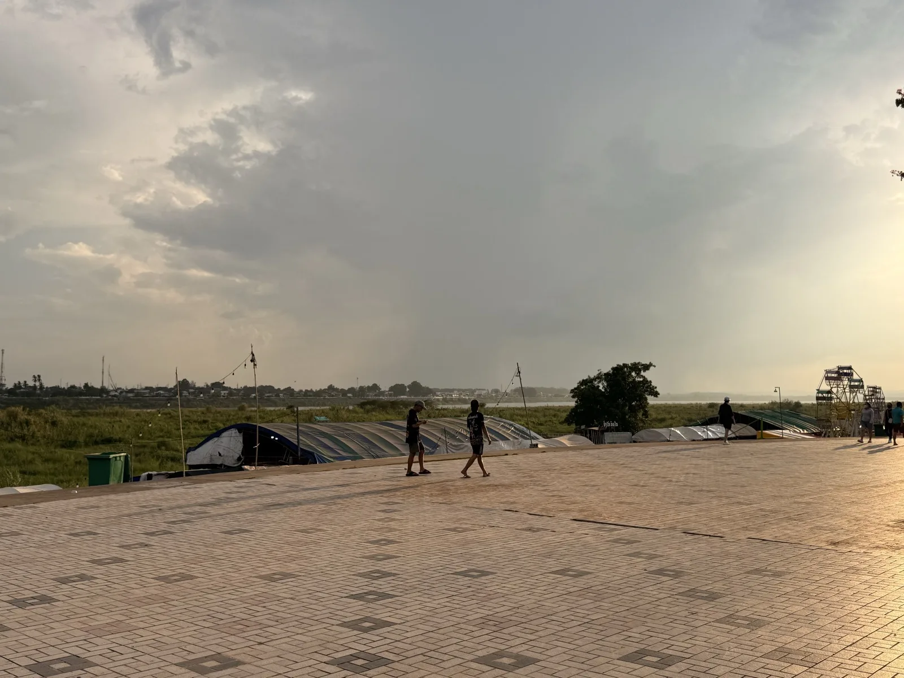
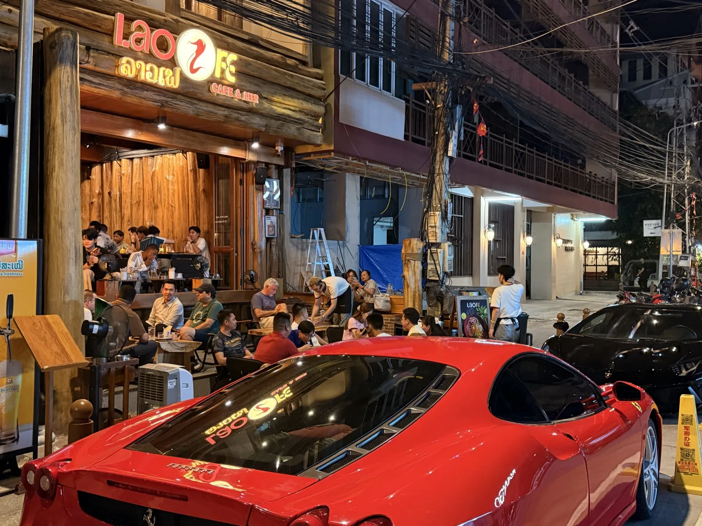
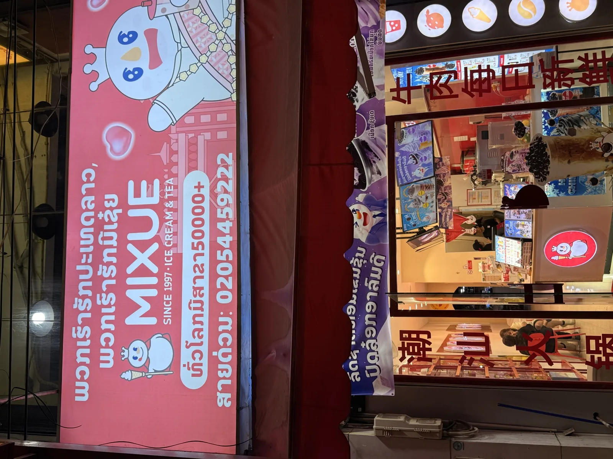

I went to Vientiane, Laos, for a short business trip. I stayed there for about three days.

This is not a complete guide to Laos. It is only my impression from a short stay in Vientiane. My overall impression was direct: the city felt underdeveloped, the infrastructure was weak, the network was poor, and the overall experience was not good.

As a business destination, Vientiane can serve the basic purpose of a trip. But as a place I would want to visit again, I do not feel that way.

## Entry: Apply for an eVisa if Possible

Chinese citizens traveling to Laos can choose either an eVisa or a visa on arrival.

The eVisa usually takes around three working days. I did not have enough time this time, so I chose the visa on arrival.

The visa on arrival works, but the queue was long and the experience was not good. For entry, I needed two things:

1. Visa on arrival
2. Arrival card

The arrival card can be filled in online in advance. The visa-on-arrival form has to be filled in on site. It is a small paper form, and you also need one photo.

There were some young women at the airport offering to help fill in the form, but they expected a tip. This help was not necessary. The form was simple enough to fill in by yourself.

The fee I saw was USD 20 for Chinese and Vietnamese citizens, and USD 40 for citizens of other countries.

My suggestion is simple: avoid visa on arrival if possible.

One reason is the long queue. Another reason is that the visa on arrival takes up a full passport page. If your passport does not have many blank pages left, several trips like this could quickly use them up. I am not sure whether this kind of visa sticker can be covered later or handled in another way, but from the point of view of saving passport pages, the eVisa is a better option.

## Exit: Laos Also Requires a Departure Card

Laos also requires a departure card.

This was surprising to me. In most countries, you only need to fill in an arrival card when entering. In Laos, you also need a departure card when leaving.

The worse part was the lack of clear reminders. When I reached the immigration counter at departure, the officer told me that I needed a departure card. I had to go back, find the small paper card, fill it in, and then queue again.

This felt outdated and inconvenient.

The problem is not only the extra form. The bigger problem is the lack of clear signs and instructions. If there had been a clear notice before the immigration queue, the experience would have been less frustrating.

## Airport: Almost Nothing Decent to Eat Before Boarding

The waiting area at Vientiane airport was also disappointing.

There was almost no proper freshly cooked food. Most options were pre-made or instant items, such as instant noodles or boxed meals that only needed to be heated.

The prices were also high for what they offered.

For a capital city airport, I expected at least some basic cooked food options. The actual choices were limited and poor in value.

## Transport: Loca Looks Smooth, but the Logic Is Confusing

When I first arrived in Vientiane, I thought the local ride-hailing app Loca was quite good. The iOS app is small and runs smoothly.

After using it, I found the logic confusing.

Especially when the network was poor, sometimes I had not fully confirmed the destination, but it seemed the app had already called a car and the driver had already started coming. This was a strange experience.

Part of the problem may have been caused by the poor network. The network experience in Vientiane was really bad.

## Tuk-tuks: Not Just Transport

There are many tuk-tuks on the streets of Vientiane.

In theory, they are just a local transport option. But my impression was not good. Some tuk-tuk drivers were not simply offering rides. When they saw me walking on the street, they would ask whether I wanted "lady" or "weed".

This made me uncomfortable.

A transport service should be a transport service. When some drivers also try to introduce prostitution, drugs, or other risky activities, the whole street environment becomes worse.

For visitors, especially people walking alone at night, this creates a strong sense of insecurity. I would not recommend randomly taking a tuk-tuk from the street. It is better to use a ride-hailing app, ask the hotel to arrange transport, or use a clearly trusted driver.

## Network: No Strong Firewall, but the Network Itself Is Poor

Laos does not seem to have the same kind of internet restrictions as China. Many services can be accessed in theory.

But the problem is that the network is too poor.

I used international roaming. My phone showed 4G or 5G, and the signal looked fine on the screen. In actual use, it often felt like there was almost no internet connection. Web pages would not open, apps got stuck, and even ride-hailing was affected.

I do not know whether a local eSIM would be better. In theory, I already had international roaming data, so I did not expect to need another local SIM.

What was even stranger was that the network sometimes seemed to block certain ports. It was not that there was no internet at all. Some services worked, while some service ports could not be reached. I found this strange.

My conclusion is that Laos may not have obvious internet censorship, but the network quality is so poor that "being able to access" many services does not really mean much.

## City Impression: A Capital City That Feels Like a Small County Town

As the capital of Laos, Vientiane did not feel very developed to me.

The overall feeling was similar to a small county-level city in China.

It was not dirty to an unbearable level. It may even be cleaner than some areas of Jakarta. But compared with Singapore or Bangkok, the gap is obvious.

At night, many places are dark, with not enough street lighting. Some streets also feel messy. As a visitor or business traveler, walking alone at night does not feel comfortable.

## Cost: Not Cheap

Many people say Laos is cheap, but my actual feeling was that Vientiane is not cheap.

There are many foreigners in the city, and there are also many businesses built around making money from foreigners. Many prices were not as low as I expected. In some cases, the value for money felt poor.

Vientiane seems to rely quite a lot on tourism-related business. Because of that, there are also many tourist-facing services, inflated prices, and possible traps. You should not assume that an underdeveloped country is automatically cheap.

## Payment: QR Payment Exists, but the Experience Is Poor

Some places in Vientiane support QR payment. It looks like they learned from China's mobile payment model.

But the actual experience was not good.

Some places have a minimum spend. Some places also charge an extra payment fee for QR payment. In other words, even when using electronic payment, you still need to pay an additional fee.

This is very different from the mature mobile payment experience in China.

## Food: Nothing Worth Expecting

During this trip, I did not find much food in Vientiane that was really worth remembering.

Some areas were lively at night, and there were night markets. But what surprised me was that many food stalls were selling seafood.

Laos is a landlocked country, so seeing so many seafood stalls felt strange to me. It is not that seafood cannot be eaten there, but the city did not give me much confidence in the food overall.

In general, the food experience did not leave a good impression on me.

## Infrastructure: Power Cuts, Mosquitoes, and Poor Internet

I stayed in Vientiane for three days. Only one day had no power cut. On the other two days, I experienced power outages.

This shows that the infrastructure is still weak.

There were also many mosquitoes. Compared with Singapore or Bangkok, the mosquito problem felt much worse. When going out at night, eating outdoors, or staying in open areas, mosquitoes were a constant problem.

These small details kept lowering the overall experience.

## Safety: Do Not Underestimate Aggressive Touting and Physical Pulling

The most memorable part of this trip was the safety issue.

In some places, people may come up to pull you, grab you, or even surround you in a group. This is not just normal friendliness or ordinary touting. It made me feel real danger.

If someone is only promoting a service, quoting a price, or asking whether you need a ride, that is still understandable. But if someone directly grabs your arm, especially when several people are involved, I think it should be treated as a dangerous situation.

Another thing I noticed was street solicitation. Some tuk-tuk drivers and street touts were not only asking whether I needed a ride. They would also ask whether I wanted "lady" or "weed". This made the city feel much less safe than a normal tourist destination.

My view is that in Vientiane, especially at night or in tourist areas, this kind of risk should not be underestimated.

If this happens, do not explain, do not argue, and do not worry about being polite. Refuse clearly, keep walking, and move toward a crowded, well-lit place with cameras. Do not get into a random tuk-tuk on the street. Do not follow anyone to another place. Do not accept any offer related to women, drugs, bars, or "special" services.

Safety is always more important than politeness.

## Conclusion: No Reason to Return

My overall impression of this business trip to Vientiane was quite negative.

The problem was not one single issue. It was the combination of many problems:

- Poor entry experience
- Long visa-on-arrival queue
- Extra departure card requirement
- Poor airport food options
- Very poor network
- Weak city infrastructure
- Power cuts
- Too many mosquitoes
- Prices not low
- Food not attractive
- Poor payment experience
- Dark and messy streets at night
- Aggressive street touting
- Tuk-tuk drivers offering prostitution or drugs
- Clear safety concerns in tourist areas

So my conclusion is direct:

Vientiane is an underdeveloped city with weak infrastructure, poor overall experience, safety concerns, and prices that are not low.

If it is for business, just finish the work and leave as soon as possible.

If it is for tourism, I personally do not recommend it.

At least for me, there is nothing in this city that makes me want to stay, miss it, or come back again.
