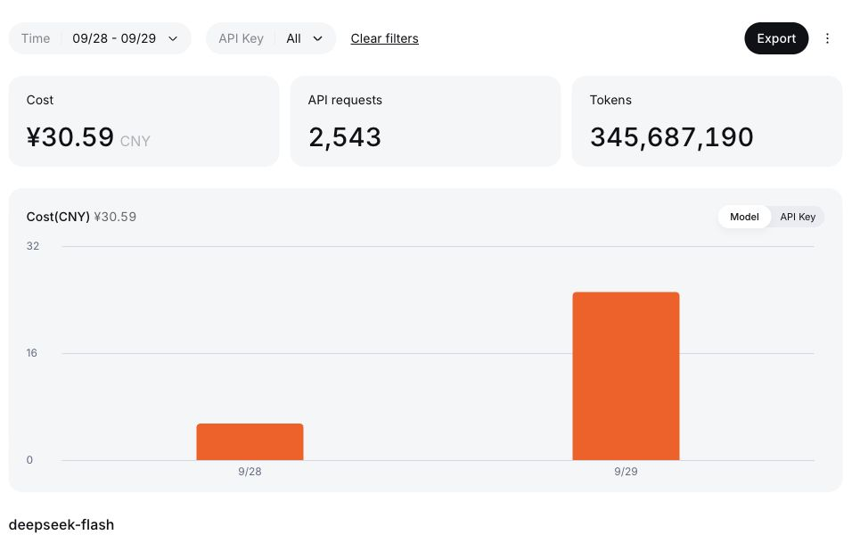

I wanted an agent runtime I could embed in a product, customize for a customer, and deliver without asking that customer to install Node.js or download npm dependencies. I also wanted to understand the runtime I was shipping.

That led to two projects:

- **[Portsmith](https://github.com/minifish-org/portsmith)**: a TypeScript-to-Go migration workbench built around the Pi Coding Agent.
- **[Pith](https://github.com/minifish-org/pith)**: the resulting Go port of selected Pi AI, agent-core, and built-in tool capabilities.

The first migration plan is complete: **26 accepted steps across three modules**. Pith builds without CGO and produces native command-line programs. That is a useful milestone, but it is not proof of complete Pi compatibility or a production-ready agent.

This is the record of what we built, how we checked it, and where the experiment goes next.

## Why port instead of starting over?

The attraction of Pi was its separation of model access, agent execution, and tools. I did not want to reinvent every streaming edge case or every interaction in an agent loop before I could build a useful product.

Go appealed to me because of its build workflow and distribution model. A compiled Go program can be a convenient artifact for a server or a user's computer. That does not eliminate operating-system differences, and a shell tool still needs a shell. It does reduce the runtime setup I need to explain to someone else.

A port also does not have to reproduce every implementation detail. A mature Go library may be a better answer than translating a TypeScript utility line by line. The important questions are which behaviors must remain equivalent, which dependencies are acceptable, and how the differences will be tested.

We pinned Pi to **v0.87.1**, commit [`f07218c4d4bbc12bef056a7058c3dd49dfe41abe`](https://github.com/earendil-works/pi/tree/f07218c4d4bbc12bef056a7058c3dd49dfe41abe). The scope was deliberately narrower than the entire repository: AI, the selected stable agent core, and built-in tools. TUI, Web UI, desktop packaging, Computer Use, MCP, and experimental/pico3 were not part of this migration.

## A plan before a loop

My initial picture was simple: give an agent some TypeScript and ask for Go. The dependency graph made that insufficient almost immediately.

We needed an inventory of source files and exported symbols, a target Go package graph, decisions about third-party libraries, explicit behavior contracts, and tests that were not just written by the same model to approve its own answer.

Portsmith therefore separates planning from execution. A human or an external coding assistant prepares the plan. Portsmith executes reviewed steps, runs verification, records checkpoints, and integrates completed modules.

The migration had **three delivery modules, 24 batches, and 26 internal steps**:

| Module | Accepted steps | Focus |
| --- | ---: | --- |
| AI | 13 | Types, streaming utilities, authentication, models, and provider adapters |
| Core | 7 | Contracts, execution loop, resources, sessions, compaction, runtime, and harness |
| Tools | 6 | Execution environment, file and shell tools, and SDK/CLI delivery |

This gave me a small number of meaningful delivery milestones while keeping each generation task manageable. I did not have to type a separate command for every source file or judge.

## Pi needed its coding-agent tools

One early mistake was giving the migration model a restricted set of custom file operations. When the generated Go failed to compile, the model did not have the same practical workflow as a coding agent working in a repository.

We changed Portsmith to embed the full **Pi Coding Agent**. It retained its native file, edit, search, and Bash tools, persistent conversations, context management, and configured skills/extensions. Portsmith added a `verify_candidate` tool so the model could receive compiler and test diagnostics, repair the candidate, and try again in the same conversation.

The division of responsibility became much clearer:

- Pi explores, implements, runs commands, and repairs code.
- Portsmith checks the frozen materials, runs independent acceptance, records progress, and decides whether a module can be integrated.

A model saying “done” does not create an accepted module. Neither do self-tests alone.

The execution environment is still the local user's environment. Setting a candidate working directory is **not sandboxing**. That matters if this approach is applied to untrusted repositories or given access to sensitive credentials.

## The failures that improved the tool

The useful lessons came from interruptions rather than from the final success message.

**Compiler diagnostics must reach the model.** Go's structured output can include `build-output` events. Filtering only ordinary test-output events hid the exact compiler error that the model needed. We fixed the diagnostic parser instead of asking the user to patch generated Go by hand.

**An arbitrary repair budget can turn automation into babysitting.** The initial outer loop stopped after a few failed attempts. We changed the default to continued repair, while keeping explicit budgets available. The same applied to fixed file-count, file-size, and verification-time limits that had been chosen for a small experiment rather than a full migration.

**Bookkeeping can fail after the code has passed.** The AI module's cumulative receipt grew to about 1.16 MB. Portsmith then rejected its own report under a 512 KiB source-file limit. The code had already passed; integration bookkeeping was the failure. The pending transaction and file hashes let us resume without regenerating the AI module.

**A live process is not necessarily making progress.** One overnight stretch was dominated by laptop sleep and request timeouts. Elapsed wall time was a poor proxy for model or compiler speed. This is one reason I am not presenting the run as a clean performance benchmark.

Removing fixed limits did not make failures disappear. Authentication problems, exhausted provider retries, changed inputs, and Git conflicts can still require intervention. Tests can also hang. “Keep going by default” is a policy choice, not a guarantee that a run will finish unattended.

## What the completion message proves

The final run reported `status: complete` and recorded these module commits:

| Module | Commit |
| --- | --- |
| AI | `a5aeab8214f672d5d83e35fec78bf4d0daf67473` |
| Core | `adbc36268f0c0cad3f5aad7c591b5f0a18f79ac0` |
| Tools | `0d4d1479739fcbe849fec21fc02cf8ac31aee237` |

The receipts record successful compilation, vet, candidate tests, independent behavior tests, and race checks. They deliberately retain **`fullParityProven: false`**.

For release preparation, I also ran a separate check on the completed tree:

- **963 passing Go test events**, with no failures or skips, using `CGO_ENABLED=0` on macOS arm64.
- All packages compiled without CGO for **macOS arm64, Linux amd64, and Windows amd64**.
- The native `pith --help` command ran locally.

Cross-compilation is not a runtime test on those other operating systems. This release check did not make live calls to every provider. A fixed set of judges cannot prove behavior that it does not exercise.

The [machine-readable evidence summary](migration-evidence.json) includes module receipts, hashes, verification outcomes, and the release checks. Pith keeps the original receipts under `migration/results/`, along with contracts, judges, and source mappings. Raw agent conversations stay local rather than becoming public artifacts.

Portsmith itself changed during the run, including changes that had not yet been committed at execution time. The earlier Portsmith commit alone is therefore not a reproducible identifier for the whole experiment. Preserving and reviewing those changes is part of preparing the repositories for release.

## What the DeepSeek dashboard showed

For **September 28–29, 2026**, in **GMT+7**, the DeepSeek dashboard showed:

| Metric | Dashboard value |
| --- | ---: |
| Cost | **¥30.59 CNY** |
| API requests | **2,543** |
| Tokens | **345,687,190** |
| Model shown | `deepseek-flash` |
| API-key filter | All |



This is **account-wide usage for the selected dates**, not a separately metered migration invoice. It includes whatever requests were billed to the account in that window, potentially including experiments and retries. It does not include the cost of the external planning assistant or local compute. The dashboard also notes that usage can lag by up to five minutes.

The token total is not the number of unique source-code tokens or generated Go tokens. It is the dashboard's aggregate usage across requests. The screenshot does not expose a cache-hit/input/output breakdown, so I am not using it to infer one.

The image is a cropped browser screenshot: account balance, profile, and the unrelated lifetime-cost figure are excluded. The date filter, API-key scope, totals, and model label remain visible.

## Building the result

The completed checkout can build its command-line programs with:

```sh
CGO_ENABLED=0 go build -mod=readonly -trimpath -o ./bin/ ./cmd/...
./bin/pith --help
```

Normal runtime builds should remain possible without CGO. The race detector is a separate testing concern and enables CGO for instrumentation. I want dependency selection to respect the no-CGO runtime goal, rather than discovering a mandatory C dependency just before shipping.

The current `pith` CLI is non-interactive and uses an OpenAI-compatible Chat Completions path. Having multiple provider packages in the repository does not mean every provider is exposed through that command. Real model calls, tool behavior in actual working directories, and session recovery still deserve hands-on acceptance testing.

Both repositories retain their existing AGPL licenses. Pi-derived material retains upstream MIT attribution. This is an independent project, not an official Pi distribution.

## Next: let Pith help maintain Pith

The next experiment is to use **Pith itself as the execution backend for future Pi-to-Pith migrations**.

The loop I want is periodic rather than a one-off rewrite:

1. Compare a new pinned Pi revision with the previous source inventory.
2. Identify affected symbols, packages, tests, and dependencies.
3. Review an incremental migration plan and update the independent contracts.
4. Use Pith to perform the port and repair candidates against those tests.
5. Preserve new receipts and submit the result for review.

That backend and scheduled loop are **planned, not implemented**. The current Portsmith executor is Pi, and an upstream change can require a design decision rather than a translation.

What I have now is a concrete starting point: a Go runtime, a migration workbench, a completed first plan, and enough evidence to inspect the result. The next question is whether this method can keep the port useful as upstream continues to change.
